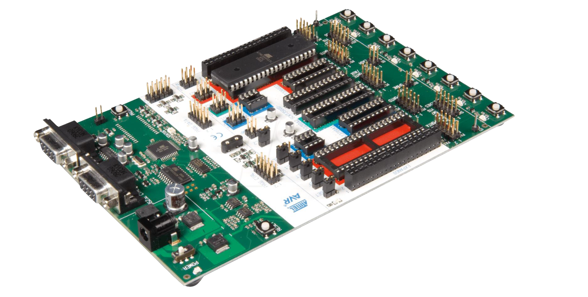

# Factory Inspection Microcontrollers Asembly

The purpose of this project is to create an automated factory inspection system using hardware and more specifically Microcontrollers ATmega16. In this system we have 3 main parts of the assemply in the factory that need to communicate. - Originally developed 27/03/2018

## In this project it was developed 
1. Build the general infrastructure in Assembly for the communications of the machines
2. Create a Robust system that can self asses and never stops even in an error encounter
3. Create a communication environment between the system and the user 

## Results of the Project 

## What I learned from this Project
It was an amazing introduction to Assembly and in general the world of micro controllers. It was a realy good transision from Arduino and RasberyPi projects to the world of low level micro controllers 

## What was the project difficulties 
It was mainly the language that it was build upon

